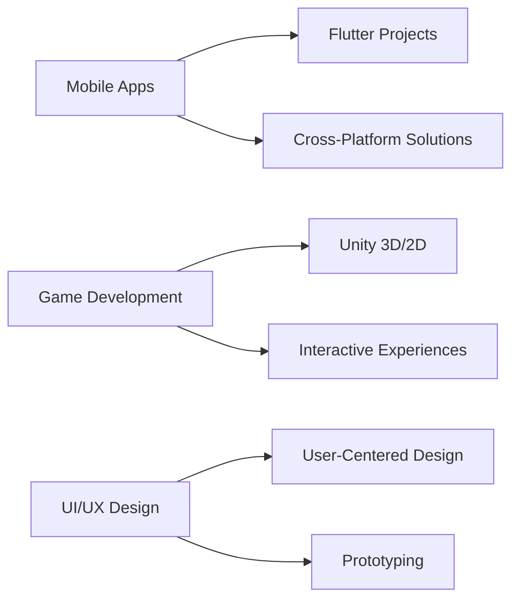

# Hi there, I'm Eren! 👋

<div align="center">
  
</div>

<div align="center">
  
</div>

---

## 🚀 About Me

```typescript
const eren = {
    pronouns: "he/him",
    location: "Turkey 🇹🇷",
    currentFocus: ["Flutter Development", "Game Development", "UI/UX Design"],
    askMeAbout: ["Mobile Apps", "Unity Games", "Frontend Development"],
    funFact: "I love turning ideas into interactive experiences! 🎮📱"
};
```

---

## 💻 Tech Stack

<div align="center">

### 📱 Mobile Development


### 🎮 Game Development


### 🌐 Web Technologies


### 🛠️ Tools & Others


</div>

---

## 📊 GitHub Analytics

<div align="center">
  
  
</div>

<div align="center">
  
</div>

---

## 🎯 Current Focus

<div align="center">



</div>

---

## 🌟 Featured Projects

<div align="center">
  <a href="https://github.com/ERNKLYC">
    
  </a>
</div>

---

## 🤝 Let's Connect!

<div align="center">
  <a href="https://www.linkedin.com/in/erenklyc/" target="_blank">
    
  </a>
  <a href="https://ernklyc.github.io/" target="_blank">
    
  </a>
  <a href="mailto:your-email@example.com" target="_blank">
    
  </a>
</div>

---

<div align="center">
  
</div>

<div align="center">
  
</div>

---

<div align="center">
  <i>💡 "Code is like humor. When you have to explain it, it's bad." – Cory House</i>
</div>

<div align="center">
  
</div>
